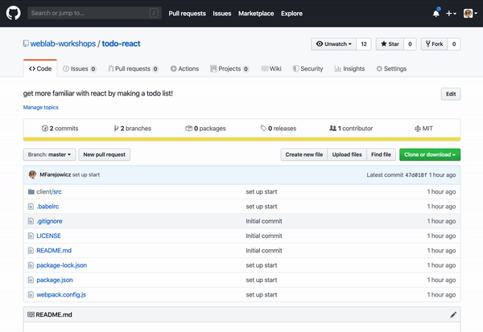
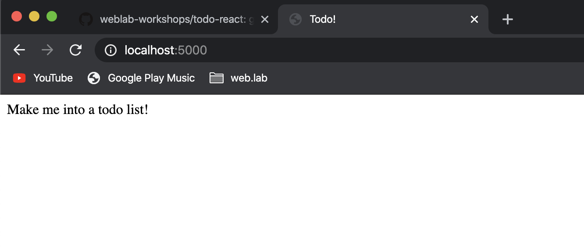
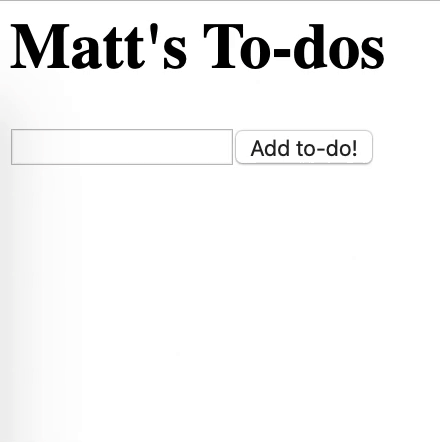

# todo-react
Get more familiar with react by making a todo list!

Here is the finished product we are aiming for:  


This README contains both step-by-step instructions and hints. At first, we recommend you scroll only far enough to see the instructions, and try to do what we ask on your own. Even for things like cloning the repository! Try to see if you remember the git commands before directly copying the commands.

Still, if you get stuck, feel free to refer back to this README.

We don't have branches for every step, so just try your best to follow along. There is a branch with staff solutions, so when you get through this README, we'll have you checkout to there and see what we did.

## STEP 0: Clone the repository
Get this repository (repo, for short) from GitHub onto your own computer. Remember, this is done with the terminal, and involves *cloning* the repo into your desired folder.

Try this on your own! See below for the commands to run, if you get stuck.

<br/>
<br/>
<br/>
<br/>
<br/>
<br/>
<br/>
<br/>
<br/>

#### Solution
On the GitHub page, copy the link to the repo by pressing this button, making sure it is set to "Clone with HTTPS"



In the terminal, use the `cd` command to navigate to the folder you want to have the repo. Then run the following command:
```
git clone https://github.com/weblab-workshops/todo-react.git
```

Congrats! You successfully *cloned the repo*.

## Step 1: Run the hotloader
Once you have the repo cloned, the next step will be run the hotloader, so that we can make changes to code and see them in our browser. The end goal of this step is to see the following in our browser. Try to get here on your own first.



<br/>
<br/>
<br/>
<br/>
<br/>
<br/>
<br/>
<br/>
<br/>

#### Solution
Before we can run the hotloader, we need to make sure that we actually navigate inside the folder first! To do so, we run
```
cd todo-react/
```
After that, we actually need to install some packages (like React!), to make this project run
```
npm install
```
Finally, we can then run the hotloader, which if you recall from past workshops, we do with the following
```
npm run hotloader
```

## Step 2: Hardcode a to-do list
Now we can finally start writing some React code (which, if you remember, just boils down to JavaScript!). The first step will be to write a React component that represents a to-do item. You can hardcode the to-do's content for now. The hard part of this step (and the thing that React should make easier!) is that we want you to write **one** React component, but then use it multiple times, with different content each time!


Hmm, how can we accomplish that? Try to match the picture. At this step, remember that the internet is your friend, and the best resource out there. For something like "how do I even make a checkbox?", google it!

<br/>
<br/>
<br/>
<br/>
<br/>
<br/>
<br/>
<br/>
<br/>

#### Hint
Like we said, we want a component to represent a to-do item. Let's call it something like `TodoItem`. We want to be able to do something like
```html
<ul>
  <ListItem />
  <ListItem />
</ul>
```
but have every list item render different text. We accomplish this with `props`! If we make a React component's `render` function depend on the `props` of that component, we can make two `ListItem`s look different, but have exactly the same code.

<br/>
<br/>
<br/>
<br/>
<br/>
<br/>
<br/>
<br/>
<br/>

#### Solution
With that knowledge of `props`, the general idea is this:  
In a parent component, such as `TodoList`, we want the following
```html
<ul>
  <ListItem content="A"/>
  <ListItem content="B"/>
</ul>
```
And `ListItem` should look something like the following
```html
class ListItem extends Component {
  constructor(props) {
    super(props);
    this.state = {
      isDone: false
    };
  }

  handleInputChange = event => {
    const value = event.target.checked;
    this.setState({
      isDone: value
    });
  };

  render() {
    return (
      <li>
        <input
          type="checkbox"
          checked={this.state.isGoing}
          onChange={this.handleInputChange}
        />
        <span>{this.props.content}</span>
      </li>
    );
  }
}
```
The crucial part here is that our `render` has a `<span>` that just directly renders the `content` prop we passed in!

The checkbox input is also pretty tricky, but hopefully you came across [this article](https://reactjs.org/docs/forms.html) in your search, and maybe learned a little about **Controlled Components**?

## Step 3: Make to-dos based on user input
The first time we build a React component, it's always helpful to pass in some hardcoded `props`, so that we know the component works as expected. The natural next step is to get rid of the hardcoding, and use dynamic data. Let's try to do that with our to-do list, and make to-do items based on user input. 


As a starting point, think about how you might represent a to-do item in `state`, our other React friend. Remember, google should be your first go-to when getting stuck.

<br/>
<br/>
<br/>
<br/>
<br/>
<br/>
<br/>
<br/>
<br/>

#### Hint
We need someplace to keep track of all these to-dos, and we need to keep track of the user's input. Let's put that in `state`. But `state` for which component? Well, the parent component `TodoList` is responsible for passing down content as `props` to `TodoItem`, and it has our text input as well, so let's put it there.

Your `TodoList` `constructor` should look something like this:
```javascript
constructor(props) {
  super(props);
  this.state = {
    todos: [],
    inputText: ""
  };
}
```
We have an array for keeping track of our list of to-dos, and a string for tracking user input. Looks good!

Next, make a button. When you hit it, you should get a new to-do that shows up.

<br/>
<br/>
<br/>
<br/>
<br/>
<br/>
<br/>
<br/>
<br/>

#### Solution
Our `ListItem` is pretty set from step 2, so we focus on `TodoList`.
```html
class TodoList extends Component {
  constructor(props) {
    super(props);
    this.state = {
      todos: [],
      inputText: ""
    };
  }

  handleInputChange = () => {
    const value = event.target.value;
    this.setState({
      inputText: value
    });
  };

  submitTodo = () => {
    const { todos, inputText } = this.state;
    const newTodos = todos.concat([ inputText ]);
    this.setState({
      todos: newTodos,
      inputText: ""
    });
  };

  render() {
    return (
      <div>
        <ul>
          {this.state.todos.map((todo, index) => (
            <ListItem
              key={`listItem-${index}`}
              content={todo}
            />
          ))}
        </ul>
        <input
          type="text"
          value={this.state.inputText}
          onChange={this.handleInputChange}
        />
        <button onClick={this.submitTodo}>Add to-do!</button>
      </div>
    );
  }
}
```
We have `handleInputChange` to deal with user input, and we have `submitTodo` to deal with hitting the button.

The other tricky thing is the `map` in the `render` function. We covered this in Workshop, and you'll use it a lot in React, so make sure you're super clear on it!

## Step 4: Delete to-dos?
If you got this far, nice work! This is probably all you really need to know to be considered "caught up". The next two steps are really just challenge/fun.

First, can you add the ability to delete to-dos?



<br/>
<br/>
<br/>
<br/>
<br/>
<br/>
<br/>
<br/>
<br/>

#### Hint
To be able to delete, we need to be able to identify which to-do item the user clicked on. Consider changing your `submitTodo` function first. When submitting a to-do, instead of just storing the text, it might be helpful to store a JavaScript object that contains the text and a unique ID number. You can choose how to generate that ID number. 

<br/>
<br/>
<br/>
<br/>
<br/>
<br/>
<br/>
<br/>
<br/>

#### Hint
What do we do with that ID number? Well, we probably want some function that handles deleting. It can take as input that ID number, and then go through the todos we have, and get rid of the one with that ID number. Where should we define this function? Where should we call this function? These are good questions to be asking at this point.

I suggest defining it in `TodoList`, since that is where we keep our to-dos, so going through them should easiest there. It should be called when we click on that X button, which looks like it lives in `ListItem`. Hmmm, how can we get a function from a parent to its child?

<br/>
<br/>
<br/>
<br/>
<br/>
<br/>
<br/>
<br/>
<br/>

#### Solution
`TodoList.js`:
```html
class TodoList extends Component {
  constructor(props) {
    super(props);
    this.idCounter = 0;
    this.state = {
      todos: [],
      inputText: ""
    };
  }

  // We need every todo to have a unique id,
  // since that's what we use to delete,
  // so we keep a running counter to make ids
  getId = () => {
    this.idCounter += 1;
    return this.idCounter;
  };

  handleInputChange...

  submitTodo = () => {
    const { todos, inputText } = this.state;
    const newTodos = todos.concat([{ text: inputText, id: this.getId() }]);
    this.setState({
      todos: newTodos,
      inputText: ""
    });
  };

  deleteTodo = (idToRemove) => {
    const { todos } = this.state;
    const filteredTodos = todos.filter(el => el.id !== idToRemove);
    this.setState({ todos: filteredTodos });
  };

  render() {
    return (
      <div>
        <ul>
          {this.state.todos.map(todo => (
            <ListItem
              key={`listItem-${todo.id}`}
              content={todo.text}
              deleteTodo={() => this.deleteTodo(todo.id)}
            />
          ))}
        </ul>
        <input
          type="text"
          value={this.state.inputText}
          onChange={this.handleInputChange}
        />
        <button onClick={this.submitTodo}>Add to-do!</button>
      </div>
    );
  }
}
```

`ListItem.js`:
```html
class ListItem extends Component {
  constructor(props) {
    super(props);
    this.state = {
      isDone: false
    };
  }

  handleInputChange = event => {
    const value = event.target.checked;
    this.setState({
      isDone: value
    });
  };

  render() {
    return (
      <li>
        <input
          type="checkbox"
          checked={this.state.isGoing}
          onChange={this.handleInputChange}
        />
        <span>{this.props.content}</span>
        <button onClick={this.props.deleteTodo}>X</button>
      </li>
    );
  }
}
```
To keep IDs, I decided to make a helper function that will increment a counter and give its new value to me. That way, I know it's unique every time. I use that in `submitTodo`. Then, `deleteTodo` takes an ID as input, and filters the to-do list to get rid of that to-do. We don't pass it directly to each `ListItem`, we actually define an anonymous function everytime, whose only job is to call `deleteTodo` with a specific ID!

Then in `ListItem`, we simply call that `deleteTodo` prop passed when we click on the X.

## Step 5: Get stylish!
No real instructions here, just make it look fun! You don't need to make it look like mine, you can do your own thing.

Remember to use `className` a plenty, and [Google Fonts](https://fonts.google.com/) for fonts!


That's it! After this step, you're done!

# See our solutions

Congrats on getting here. We hope this exercise helped you understand React a bit better. Before seeing our solutions, I recommend you run the following commands in your terminal

```
git add .
git commit -m 'my changes'
```

If you recall the git lecture, this will commit your changes **locally**. This way, when we get to the solutions, we won't lose all your hard work.

To get to the solutions, run the following command in your terminal
```
git checkout complete
```
This will replace your code with our solution, which you can explore as much as you want. If you ever want to get back to your work, simply run
```
git checkout master
```

That's all! If you have any questions, feel free to ask on [Piazza](https://piazza.com/class/k3waim4oo0v69j).